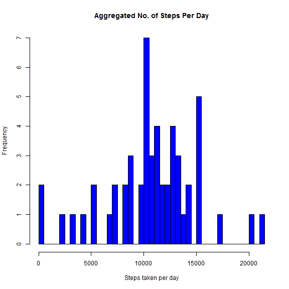
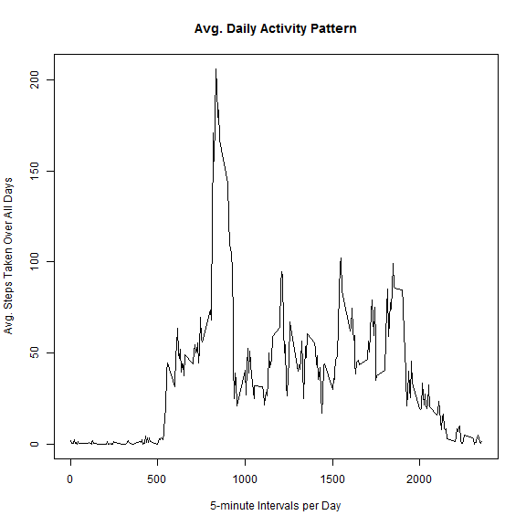
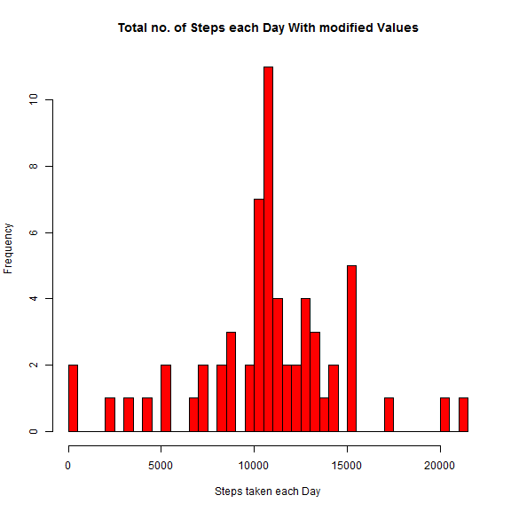
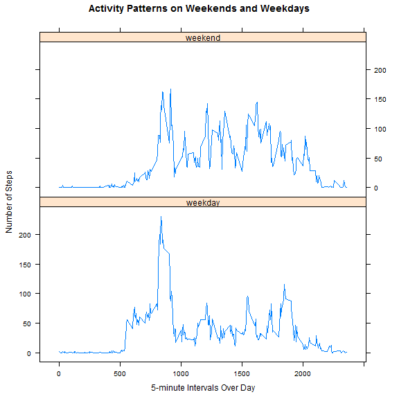

# Reproducible Research: Peer Assessment 1

## Loading and preprocessing the data


```r
## unzip the data set from
## https://d396qusza40orc.cloudfront.net/repdata%2Fdata%2Factivity.zip
unzip("repdata-data-activity.zip")

# read the data
activity_data <- read.csv("activity.csv")
```


## What is mean total number of steps taken per day?


```r
# to calculate the total number of steps taken per day
no_steps_per_day <- aggregate(steps ~ date, data = activity_data, FUN = sum)
```


```r
# make a histogram of the total number of steps taken each day
hist(no_steps_per_day$steps, breaks = nrow(no_steps_per_day), main = "Aggregated No. of Steps Per Day", 
    xlab = "Steps taken per day", col = "blue")
```

 


```r
# calculate the mean and median of steps using mean() and median()
AVG_no_steps_per_day <- mean(no_steps_per_day$steps)
MEDIAN_no_steps_per_day <- median(no_steps_per_day$steps)
```

The average no. of steps taken each day is 10766  
The median no. of steps taken each day is 10765

## What is the average daily activity pattern?


```r
# calculate the mean of steps taken for every 5 min interval
AVG_per_5min_interval <- aggregate(steps ~ interval, data = activity_data, FUN = mean)
```


```r
# make a time series plot taking the 5-minute interval on x-axis and the
# average number of steps across all days on y-axis
plot(AVG_per_5min_interval, type = "l", main = "Avg. Daily Activity Pattern", 
    xlab = "5-minute Intervals per Day", ylab = "Avg. Steps Taken Over All Days")
```

 


```r
# find the 5-minute interval, on average across all the days in the dataset,
# that contains the maximum number of steps
MAX_step_interval <- AVG_per_5min_interval[which.max(AVG_per_5min_interval$steps), 
    "interval"]
```

The 5-minute interval, on average across all days, that contains the maximum number of steps is 835

## Imputing missing values

```r
## calculate the total number of missing values in the dataset
total.NAs <- sum(is.na(activity_data))
```

The total no. of NA(missing) values in the dataset are 2304.  
We will replace the missing NA values with average of interval steps across all the days under
consideration.


```r

# We create a subset vector with the NA values replaced by 5-min interval's
# averaged values across all the days
NA_values_imputed_vector <- numeric()
for (i in 1:nrow(activity_data)) {
    row <- activity_data[i, ]
    if (is.na(row$steps)) {
        steps <- subset(AVG_per_5min_interval, interval == row$interval)$steps
    } else {
        steps <- row$steps
    }
    NA_values_imputed_vector <- c(NA_values_imputed_vector, steps)
}

## Now we create a new dataset with the properly inserted 'modified' NA
## values
NA_values_imputed_vector.data <- activity_data
NA_values_imputed_vector.data$steps <- NA_values_imputed_vector

# find the total number of steps taken each day
total_steps_each_day <- aggregate(steps ~ date, data = NA_values_imputed_vector.data, 
    FUN = sum)
```


```r
# make a histogram of the total number of steps taken each day
hist(total_steps_each_day$steps, breaks = nrow(total_steps_each_day), main = "Total no. of Steps each Day With modified Values", 
    xlab = "Steps taken each Day", col = "red")
```

 


```r
# Calculate the mean and median total no. of steps taken each day
AVG_total_steps_each_day <- mean(total_steps_each_day$steps)
MEDIAN_total_steps_each_day <- median(total_steps_each_day$steps)
```

The mean total number of steps taken per day is 10766  
The median total number of steps taken per day is 10766

Clearly the impact of the replacing the NAs with avg. of 5-min intervals across all days was a slight increase in the median total number of steps per day. 

## Are there differences in activity patterns between weekdays and weekends?


```r
## change date column from factor to Date

NA_values_imputed_vector.data$date <- as.Date(NA_values_imputed_vector.data$date)

## factor variable to demarcate whether date is weekday or weekend

weekend.days <- c("Saturday", "Sunday")
NA_values_imputed_vector.data$daytype <- as.factor(sapply(NA_values_imputed_vector.data$date, 
    function(x) ifelse(weekdays(x) %in% weekend.days, "weekend", "weekday")))
```


```r
## Make a panel plot
require(plyr)
```

```
## Loading required package: plyr
```

```r
AVG_steps <- ddply(NA_values_imputed_vector.data, .(interval, daytype), summarize, 
    steps = mean(steps))

require(lattice)
```

```
## Loading required package: lattice
```

```r
xyplot(steps ~ interval | daytype, data = AVG_steps, layout = c(1, 2), type = "l", 
    xlab = "5-minute Intervals Over Day", ylab = "Number of Steps", main = "Activity Patterns on Weekends and Weekdays")
```

 

